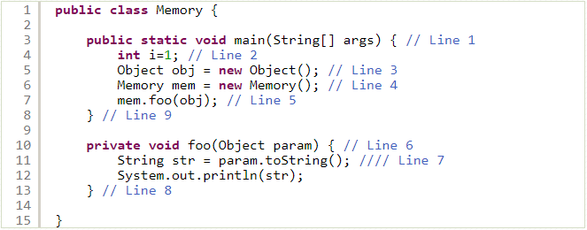
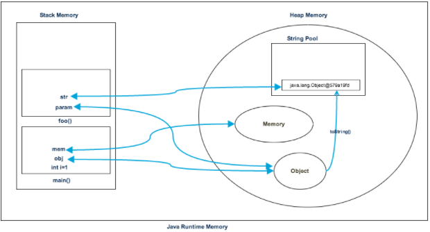
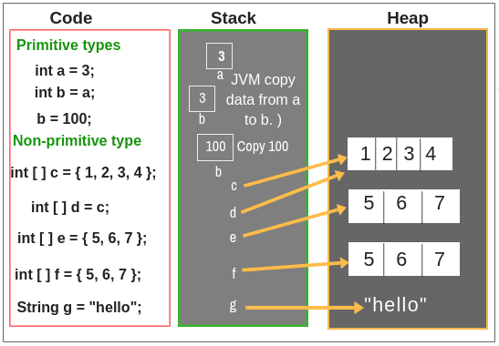

#HEAD and Stack
## Định nghĩa:
- Head và Stack là một phần trong memory được JVM sử dụng để chạy chương trình. 
- Khi run program, JVM sẽ yêu cầu OS cấp cho một không gian bộ nhớ trong RAM và chia chúng thành 2 phần: Head & Stack
 

##Head Memory:
- Được sử dụng khi runtime 
- Lưu các Object 
- Mọi nơi trong ứng dụng có thể truy cập các Object trong Head, bởi <b>nhiều thread</b> khác nhau 
- Life Time của Head phụ thuộc vào Garbage Collection. Garbage Collection sẽ chạy trên Head memory để xóa những Object không được sử đụng nữa 
- Vì thế dung lượng HEAD dựa vào số lượng Object sử dụng 
- Vì phải lưu Object nên dung lượng được chia cho nó lớn hơn Stack 
- Sử dụng <b>-Xms</b> và <b>-Xmx</b> để định nghĩa dung lượng bắt đầu và dung lượng tối đa của bộ nhớ heap. 
- Khi Heap bị đầy chương trình hiện lỗi <b>java.lang.OutOfMemoryError: Java Heap Space</b>

##Stack Memory
- Được sd khi runtime 
- Lưu biến local(biến primitive, biến được tham chiếu đến Object(trong HEAD), parameter trong function) trong function, lời gọi function trong <b>1 Thread</b>  
- Bộ nhớ thường nhỏ 
- Chạy theo cơ chế <b>L-I-F-O(Last In First Out)</b> 
- Bất cứ khi nào gọi 1 function, một khối bộ nhớ mới sẽ được tạo trong Stack cho function đó để lưu các biến local. Khi function thực hiện xong, khối bộ nhớ cho hàm sẽ bị xoá, và giải phóng bộ nhớ trong stack. 
- Dùng <b>-Xss</b> để định nghĩa dung lượng bộ nhớ stack. 
- Khi stack bị đầy bộ nhớ, chương trình phát sinh lỗi: <b>java.lang.StackOverFlowError</b> 

##Example
 
 

##Example 1
 

##Notes
1. Truy cập vào Stack sẽ nhanh hơn truy cập vào Head. Chính vì thế hãy sử dụng biến primitive(int,...) thay vì sử dụng non-primitive(Integer,...) khi thật sự không cần thiết
 
[Link Ở đây](https://stackoverflow.com/questions/2509025/when-to-use-primitive-and-when-reference-types-in-java) có 1 discuss room giữa <b>primitive-int</b> và <b>Wrapper-Integer</b>, khi nào nên sử dụng loại nào
2. Tại sao: "Stack memory is short-lived whereas heap memory lives from the start till the end of application execution.
" ??
-> Có thể là do Object có thể khởi tạo ở 1 nơi, nhưng có thể tham chiếu từ nhiều chỗ. khởi tạo 1 Object trong funcA, truyền Object vào funcB sử dụng parameter -> lúc này trong HEAD chỉ khởi tạo 1 lần cho Object đó, và function sử dụng chỉ là tham chiếu thôi

