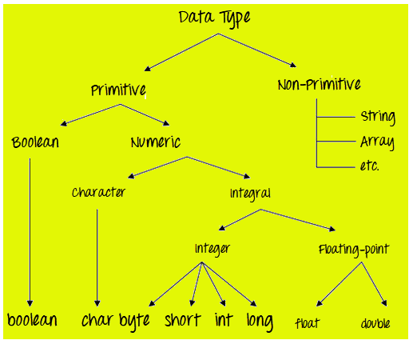
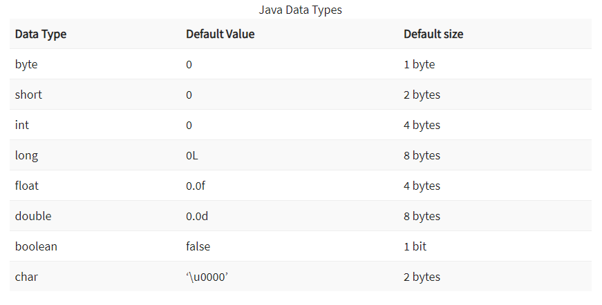
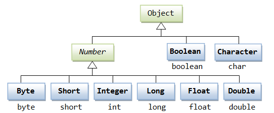

# Tóm tắt Java core
"WRITE ONCE, RUN ANYWHERE"

## 1. Tính năng nổi bật:
- OPP<br>
- Bảo mật<br>
- Độc lập nền tảng<br>
- Đa nhiệm (multi-threaded)<br>
<br>

## 2. Ứng dụng:
- Java SE(Java System Edition): application, mạng, giao diện control<br>
- Java EE(Java Enterprise Edition): web<br>
- Java ME(Java Mobile Edition): game, app mobile
<br>

## 3. Thành phần:
- JVM(Java virtual machine): môi trường thực thi mã Java Bytecode<br>
	
	<br>
<br>
- JRE(Java runtime environment): JVM + Libs<br>
- JDK(Java development kit): JRE + development tools<br>

## 4. Variables:
Variable là tên của vùng nhớ, lưu giá trị<br>
### - Local variable:
+ Được khai báo trong <b><i>methods, contructor, block</i></b>. Thực thi xong methods, contructor, block thì biến cũng được giải phóng(destroyed)<br>
+ <b>KHÔNG</b> access-modifier<br>
+ Không tự khởi tạo giá trị, nên phải khai báo kèm giá trị<br>
+ Lưu trong <b>STACK</b>
<br>

### - Instance variable:
+ Biến ở level <b><i>class</i></b><br>
+ Instance variable được tạo, khi Object được tạo với từ khóa <b>new</b><br>
+ CÓ “access-modifier” (mặc định là default)<br>
+ Có gán giá trị default nếu không khởi tạo giá trị<br>
+ Lưu trong <b>HEAD</b><br>

### - Static variable:
+ Biến ở level <b>class</b><br>
+ Được tạo khi bắt đầu, và destroyed khi kết thúc program -> <b>chỉ khởi tạo 1 lần</b><br>
+ Có gán giá trị default nếu không khởi tạo giá trị<br>
+ Truy cập bằng cách: <b>TenClass.TenBien</b><br>
+ Được lưu trong bộ nhớ <b>STATIC</b><br>
+ Thường được sử dụng với final -> hằng số
	<br>
	
### - Const:
+ Là giá trị bất biến trong program<br>
+ Phải tự gán giá trị khởi tạo<br>
+ Thường sử dụng vs static: public/private static final<br>
+ Là const thì tên biến phải viết hoa, từ cách từ bằng "_"<br>

## 5. Modifiers:
### - Access Modifiers:
sử dụng ở: classes, variables, methods and constructors<br>
+ package -> default<br>
+ class only -> private<br>
+ world -> public<br>
+ package + all subclasses -> protected<br><br>

### - Non-Access Modifiers:
+ <b>static</b> modifier: class, methods and variables.<br>
+ <b>final</b> modifier: classes, methods, and variables.<br>
+ <b>abstract</b> modifier: abstract classes and methods.<br>
+ <b>synchronized</b> and <b>volatile</b> modifiers, which are used for <i>threads</i>.<br>

## 6. Data Type

<br>
<br>

### Notes:
- <b>char</b> data type in Java is <b>2 bytes</b> because it uses <b>UNICODE</b> character set

## 7. Wrapper - autoBoxing & unboxing

<br>

```
//autoBoxing
int → Integer: Integer numInteger = Integer.valueOf(numInt);
		Integer numInteger1 = numInteger; 
//unBoxing
Integer → Int: int numInt1 = numInteger.intValue();
		int numInt2 = numInteger1; 
```

#### Tại sao lại sử dụng Wrapper:
- Có thể sử dụng Wrapper trong Collection<br>
	``List<Integer> intList = new ArrayList<>();``
- Cần sử dụng biến có giá trị NULL
- Có thể nhận được lỗi NullPointerException, dễ dàng phát hiện lỗi

#### Hạn chế:
- Primitive thì nhanh hơn Wapper
- Phép toán so sánh == sẽ không chính xác:<br>
		`== so sánh tham chiếu (reference or address)`<br>
		`.equal() so sánh tham trị (value)`

#### Thứ tự ép kiểu nới rộng(widening): ko mất dữ liệu
``byte -> short -> int -> long -> float -> double``

## 8. Abstract vs Interface
Khi nào sử dụng:<br>
- Interface thường được dùng để mô tả một tập các chức năng. Một class thừa kế một interface A, ta nói rằng class đó có thể thực hiện các năng của interface A khai báo, mà chưa cần xem code.
- Abstract class thường được dùng trong mối quan hệ thừa kế, vì tính linh hoạt của nó có thể chứa abstract method và method thông thường. Dựa vào đó mà chúng ta có thể định nghĩa các khuôn mẫu hay triển khai những thuộc tính, method mà các class con có thể dùng chung.
<br>

Sự khác nhau:
- Chỉ extends 1 class/abstract-class nhưng có thể implement nhiều interface
- Methods:
Interface: **public abstract method**
Abstract-class: chứa **protected/public abstract method** và cả **method thông thường**
- Variables:
Interface: **public static final ...**
Abstract-class: **static, final hoặc static final biến**


