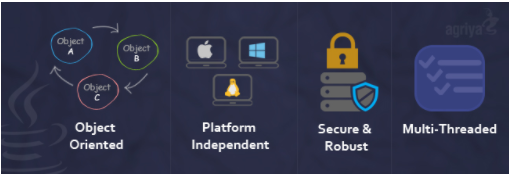
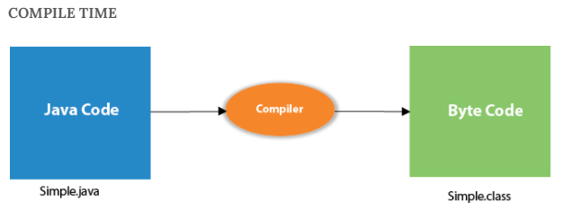
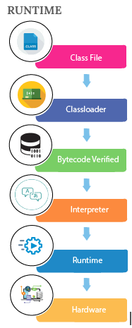

# Tóm tắt Java core
"WRITE ONCE, RUN ANYWHERE"

1. Tính năng nổi bật: 
	- OPP 
	- Bảo mật 
	- Độc lập nền tảng 
	- Đa nhiệm (multi-threaded) 
	 
2. Ứng dụng: 
		 
	- Java SE(Java System Edition): application, mạng, giao diện control 
	- Java EE(Java Enterprise Edition): web 
	- Java ME(Java Mobile Edition): game, app mobile
	  
3. Thành phần: 
	- JVM(Java virtual machine): môi trường thực thi mã Java Bytecode 
		
		 
	 
	- JRE(Java runtime environment): JVM + Libs 
	- JDK(Java development kit): JRE + development tools 
	 
4. Variables: 
	Variable là tên của vùng nhớ, lưu giá trị 
	<strong>- Local variable:</strong>  
		+ Được khai báo trong <b><i>methods, contructor, block</i></b>. Thực thi xong methods, contructor, block thì biến cũng được giải phóng(destroyed) 
		+ <b>KHÔNG</b> access-modifier 
		+ Không tự khởi tạo giá trị, nên phải khai báo kèm giá trị 
		+ Lưu trong <b>STACK</b>
	  
	<strong>- Instance variable:</strong>  
		+ Biến ở level <b><i>class</i></b> 
		+ Instance variable được tạo, khi Object được tạo với từ khóa <b>new</b> 
		+ CÓ “access-modifier” (mặc định là default) 
		+ Có gán giá trị default nếu không khởi tạo giá trị 
		+ Lưu trong <b>HEAD</b> 
		 
	<strong>- Static variable:</strong> 
		+ Biến ở level <b>class</b> 
		+ Được tạo khi bắt đầu, và destroyed khi kết thúc program -> <b>chỉ khởi tạo 1 lần</b> 
		+ Có gán giá trị default nếu không khởi tạo giá trị 
		+ Truy cập bằng cách: <b>TenClass.TenBien</b> 
		+ Được lưu trong bộ nhớ <b>STATIC</b> 
		+ Thường được sử dụng với final -> hằng số
		  
	<strong>- Const:</strong> 
		+ Là giá trị bất biến trong program 
		+ Phải tự gán giá trị khởi tạo 
		+ Thường sử dụng vs static: public/private static final 
		+ Là const thì tên biến phải viết hoa, từ cách từ bằng "_"  

5. Modifiers: 
	<strong>- Access Modifiers:</strong> 
		sử dụng ở: classes, variables, methods and constructors 
		+ package -> default 
		+ class only -> private 
		+ world -> public 
		+ package + all subclasses -> protected  
		 
	<strong>- Non-Access Modifiers:</strong> 
		+ <b>static</b> modifier: class, methods and variables. 
		+ <b>final</b> modifier: classes, methods, and variables. 
		+ <b>abstract</b> modifier: abstract classes and methods. 
		+ <b>synchronized</b> and <b>volatile</b> modifiers, which are used for <i>threads</i>. 
	
