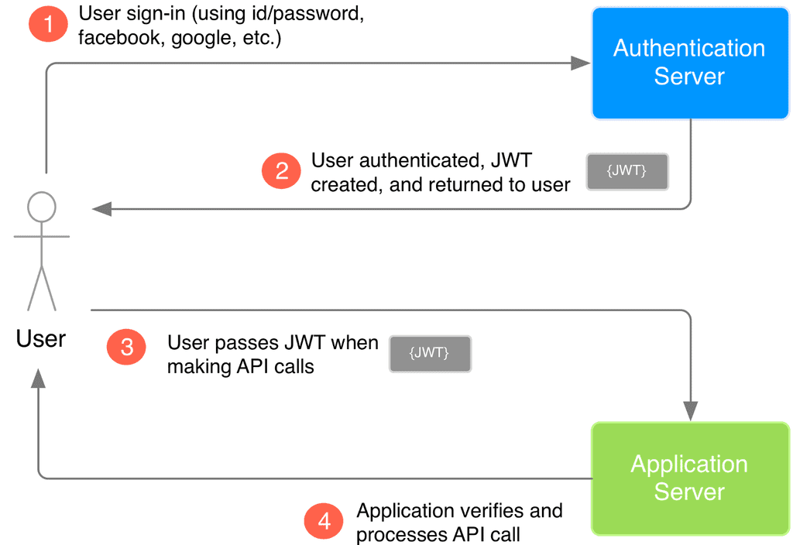

# Spring Security

link kham khảo [spring-security-example](https://github.com/loda-kun/spring-boot-learning/tree/master/spring-security-example)

## Introduce
Giúp phân quyền và xác thực người dùng trước khi truy cập vào tài nguyên của hệ thống

## Configuration

### 1. Add dependencies
<i>org.springframework.security</i>

### 2. Enable WebSecurity
Để enable security ta phải gắn <b>@EnableWebSecurity</b> annotation trên 1 Bean bất kỳ. Ở chính class này sẽ tập trung các xử lý liên quan đến security

```
@EnableWebSecurity
public class WebSecurityConfig extends WebSecurityConfigurerAdapter {

    @Bean
    @Override
    public UserDetailsService userDetailsService() {
        // ...
    }
}
```

- <b>WebSecurityConfigurerAdapter</b> là 1 interface tiện ích của Spring Sercurity, giúp chúng ta cài đặt thông tin dễ dàng hơn

### 3. Phân quyền truy cập
Cho phép User truy cập vào tài nguyên nào

```
@EnableWebSecurity
public class WebSecurityConfig extends WebSecurityConfigurerAdapter {

  @Override
  protected void configure(HttpSecurity http) throws Exception {
    http
        .authorizeRequests()
            .antMatchers("/", "/home").permitAll() // Allow everybody access vào 2 địa chỉ này
            .anyRequest().authenticated() // all other requests cần phải xác thực trước khi access
            .and()
        .formLogin() // Cho phép người dùng xác thực bằng form login
            .defaultSuccessUrl("/hello")
            .permitAll() // Tất cả đều được truy cập vào địa chỉ này
            .and()
        .logout() // Cho phép logout
            .permitAll();
  }
}
```

- <b>HttpSecurity</b> là đối tượng chính của Spring Security, giúp chúng ta config mọi thứ cần bảo mật và nó được xây dựng dưới design pattern giống vs Builder Pattern->mọi thứ có thể viết liên tục thông qua "."<br>
- .permit() để cấp phép, .authenticated() để yêu cầu xác thực
- .formLogin() cung cấp link cho người dùng đăng nhập, default là "/login" do SpringSecurity tự tạo
- .logout() cho phép người dùng logout, SpringSecurity mặt định là "/logout"

### 4. Sử dụng
Các địa chỉ /login và /logout thì không cần tạo Controller, Spring Security đã tạo sẵn rồi

### Custom login when connect with DB
#### 5. UserDetails
Mặt định của SpringSecurity sử dụng 1 đối tượng UserDetails để chứa thông tin người dùng<br>
Vì vậy, chúng ta cần tạo ra một class mới giúp chuyển các thông tin của User thành UserDetails

#### 6. UserDetailsService
Khi người dùng đăng nhập thì SpringSecurity sẽ sử dụng UserDetails để kiểm tra. Vì vậy cần tạo ra 1 class thừa kế UserDetailsService mà Spring cung cấp để làm nhiệm vụ này<br>
Override loadUserByUsername() của UserDetailsService và thực hiện kiểm tra user với database trong này<br>

### Custom login with JWT
- JWT(Json web token) là chuỗi mã hóa kèm gửi kèm theo request trên Header, giúp phía server xác thực request người dùng có hợp lệ hay không.
<br> <br>

- Sau khi có các thông tin về người dùng, chúng ta cần mã hóa thông tin người dùng thành chuỗi JWT. Tạo ra một class JwtTokenProvider để làm nhiệm vụ này.<br>

- Chỉnh lại thông tin Config, thêm lớp filter <b>JwtAuthenticationFilter</b><br>
Có nhiệm vụ kiểm tra request của người dùng trước khi nó tới đích. Nó sẽ lấy Header Authorization ra và kiểm tra xem chuỗi JWT người dùng gửi lên có hợp lệ không.

- Tạo Controller(2 APIs)<br><br>
Kham khảo JWT tại đây: [huong-dan-spring-security-jwt-json-web-token](https://loda.me/huong-dan-spring-security-jwt-json-web-token-hibernate-loda1556683105052/)

 

