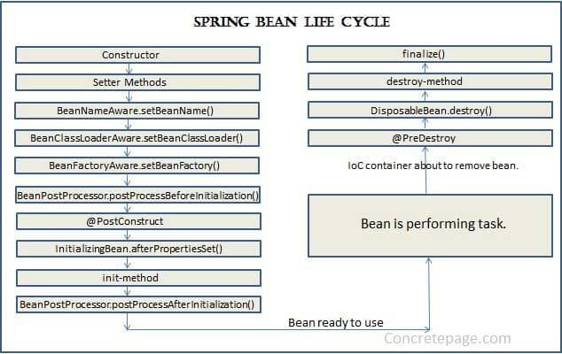

# Bean Life Cycle
@PostConstruct và @PreDestroy là 2 Annotation cực kỳ ý nghĩa, nếu bạn nắm được vòng đời của một Bean, bạn có thể tận dụng nó để làm các nhiệm vụ riêng như setting, thêm giá trị mặc định trong thuộc tính sau khi tạo, xóa dữ liệu trước khi xóa, v.v.. Rất nhiều chức năng khác tùy theo nhu cầu.

## @PostConstruct
Có thể được tạo trong Bean/IOC Container/ApplicationContext, được thực hiện <b>sau khi</b> 1 Bean được tạo và quản lý

## @PreDestroy
Có thể được tạo trong Bean/IOC Container/ApplicationContext, được thực hiện <b>trước khi</b> 1 Bean bị xóa hoặc không đc quản lý nữa

## Bean life Cycle

Hiểu nôm na:
- Khi IoC Container(ApplicationContext) tìm thấy một Bean cần quản lý, nó sẽ khởi tạo bằng Constructor
- Inject dependencies vào Bean bằng Setter, và thực hiện các quá trình cài đặt khác vào Bean như setBeanName, setBeanClassLoader, v.v..
- Hàm đánh dấu @PostConstruct được gọi
- Tiền xử lý sau khi @PostConstruct được gọi.
- Bean sẵn sàng để hoạt động
- Nếu IoC Container không quản lý bean nữa hoặc bị shutdown nó sẽ gọi hàm @PreDestroy trong Bean
- Xóa Bean.