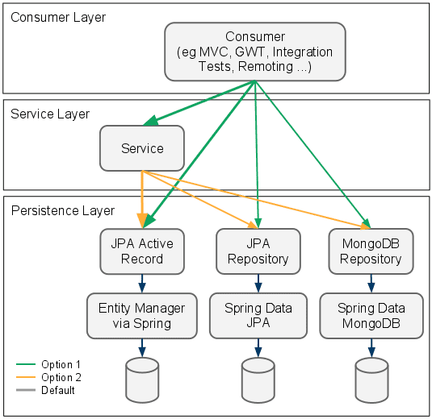

# Kiến trúc MVC trong SpringBoot

Kiến trúc MVC trong Springboot được xây dựng trên tư tưởng "độc lập" + thiết kế OOP(đại diện tiêu biểu là DI) 
Độc lập ở đây ám chỉ là các layer phục các mục đích nhất định
  
Gồm có 3 layer <b>Controller-Servicce-Repository</b>:  

  
- **Consumer Layer hay Controller**: là tầng giao tiếp với bên ngoài và handler các request từ bên ngoài tới hệ thống.
- **Service Layer**: Thực hiện các nghiệp vụ và xử lý logic
- **Repository Layer**: Chịu trách nhiệm giao tiếp với các DB, thiết bị lưu trữ, xử lý query và trả về các kiểu dữ liệu mà tầng Service yêu cầu.

Tương ứng vs 3 layer sẽ có 3 annotation: @Controller, @Service, @Repository

#### Điểm chú ý:
- Thực chất **@Controller, @Service, @Repository** cũng là các **@Component**. Đặt tên khác nhau để phân biệt từng tầng trong 1 project
- Vì chúng cũng là các @Component nên vẫn hiểu nó là Bean, và đc lưu và thực hiện inject trong ApplicationContext
- Chúng ta có thể sử dụng tùy ý đảo lộn bất cứ Annotation với nhau đều hoạt động được, nhưng không khuyến khích điều đó -> dễ gây nhầm lẫn, ko thể kiểm soát 

