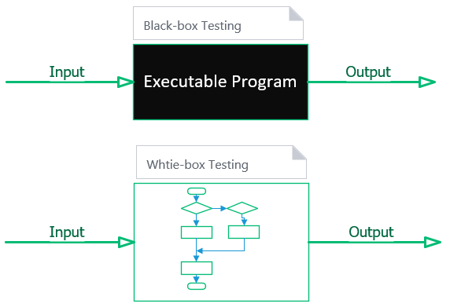

# Tìm hiểu về Testing trong sofware

## Testing - Kiểm thử
là quá trình đánh giá 1 hệ thống hay các thành phần với mục đích đảm bảo nó hoạt động đúng theo yêu cầu đưa ra. 
Nôm na cũng có thể hiểu test là quá trình để xác nhận bất kỳ thiếu sót(defect), lỗi(bug), sai sót(error) hay những yêu cầu bị bỏ quên, những yêu cầu không đúng với thực tế đề ra

## Thời điểm bắt đầu thực hiện test
Việc kiểm thử-test sớm bắt đầu sẽ giúp giảm thiểu được chi phí và thời gian để xây dựng lại và sửa đổi để bàn giao sản phẩm. 
Trong 1 vòng đời của sản phẩm, việc test nên được bắt đầu từ khi nhận yêu cầu từ phía khách hàng và xuyên suốt đến lúc bàn giao sản phẩm. 
Nhưng thực thế thời điểm thực hiện kiểm thử còn phụ thuộc vào mô hình phát triển đang được sử dụng. Ví dụ: 
- Mô hình waterfall: testing được thực hiện ở gia đoạn kiểm thử-testing phase.
- Mô hình Incremental: testing được thực hiện ở cuối mỗi chu kỳ con và kiểm thử cho toàn bộ sản phẩm được thực hiện ở giai đoạn cuối của sản phẩm.

## Công việc,
Việc test được thể hiện theo nhiều giai đoạn khác nhau:
- Trong quá trình tập hợp các requirement: Phân tích và xác minh yêu cầu - test requirement
- Trong giai đoạn design: Kiểm tra lại thiết kế với mục đích cải thiện
- Trong giai đoạn implement: kiểm thử được thực hiện bởi developer - unit-test

## Khi nào dừng test
Đây là quá trình không bao giờ kết thúc, và ko thể đảm bảo yêu cầu sản phẩm được test 100%. Có thể cân nhắc dựa theo các khía cạnh dưới đây:

- Deadline
- Đã pass hết các test-case đề ra
- Đảm bảo chức năng được hoàn thiện và toàn bộ code đã thỏa các yêu cầu đưa ra
- Tỷ lệ bug trong giới hạn cho phép
- Không có những bug nghiêm trọng
- Quyết định của cấp trên(manager)

## Phân loại testing
- **Black-box testing** : chúng ta không cần quan tâm những gì xử lý trong cái hộp đen đó làm, chỉ cần cho đầu vào và xác nhận đầu ra. Đây chính là những gì bộ phận QA độc lập thực hiện.
- **White-box testing** : chúng ta cần quan tâm những gì xử lý trong hộp trắng đó làm, tức là code được viết như thế nào, kiến trúc, logic xử lý ra sao. Đây chính là một phần mà developer cần làm. Gồm:  Unit Testing/ Integration Testing/ Functional Testing

### 1. UnitTest - Kiểm thử đơn vị
UnitTest là một mức kiểm thử trong quá trình testing, với mục đích xác định từng unit đúng theo design/document. 
UnitTest là mức test nhỏ nhất trong bất kỳ phần mềm nào. Thông thường nó được xác định là 1 method hay 1 class. Nhưng cũng tùy vào kinh nghiệm và kỹ năng của developer sẽ có cách xác định unit khác nhau

**Tại sao lại viết UnitTest?** 

- Chi phí cho việc biết UT ít hơn nhiều so với các testing phrase như là system test, acceptance testing. Nhất là các chi phí khi issues/bug đến từ bên khách hàng
- UT giúp developer tăng khả năng tối ưu code, nâng khả năng tư duy về code
- Giảm lượng bugs phát sinh trong các giai đoạn testing tiếp theo
- Phát hiện sớm các vấn đề về thiết kế, xử lý hệ thống, thậm chí các mô hình thiết kế
- Sẽ giảm thiểu thời gian development. vì ít sing bug và issue về sau

**Khi nào, Ai sẽ thực hiện?** 
UnitTest là mức kiểm thử đầu tiên trong các mức testing, thực hiện trước Integration Testing. Sẽ do developer thực hiện, nên được thực hiện càng sớm càng tốt trong giai đoạn viết code và xuyên suốt quá trình phát triển phần mềm

**Mục đích**  
 - Cô lập từng phần
 - Tăng sự đảm bảo khi có sự thay đổi code
 - Code dễ sử dụng, dễ hiểu, tái sử dụng, dễ debug
 - Chi phí thấp hơn so với các mức testing về sau
 
### 2. Interation Testing - Kiểm thử tích hợp
 - Interation Testing là mức kiểm thử phần mềm với mục đích kiểm tra các nhóm module nhỏ liên quan đến nhau có hoạt động đúng chức năng theo thiết kế hay không
 - Do developer thực hiện
 
### 3. System Testing - Kiểm thử hệ thống
System Testing là một mức của kiểm thử phần mềm, với mục đích xác nhận xem hệ thống phần mềm có đáp ứng theo đặt tả yêu cầu(document require) không.
 - Do các tester thực hiện

### 4. Acceptance Test - Kiểm thử chấp nhận
Acceptance test về cơ bản là mô phỏng các thao tác của người dùng sản phẩm để xem kết quả có đúng với mong muốn không.
- Được thực hiện trước khi đưa sản phẩm vào sử dụng chính thức
- Thường sẽ do người dùng cuối/khách hàng/bên thứ 3 thực hiện

Link kham khảo: 
[gpcoder.com tim-hieu-ve-kiem-thu-tesing-trong-phat-trien-phan-mem](https://gpcoder.com/5194-tim-hieu-ve-kiem-thu-tesing-trong-phat-trien-phan-mem/) 
